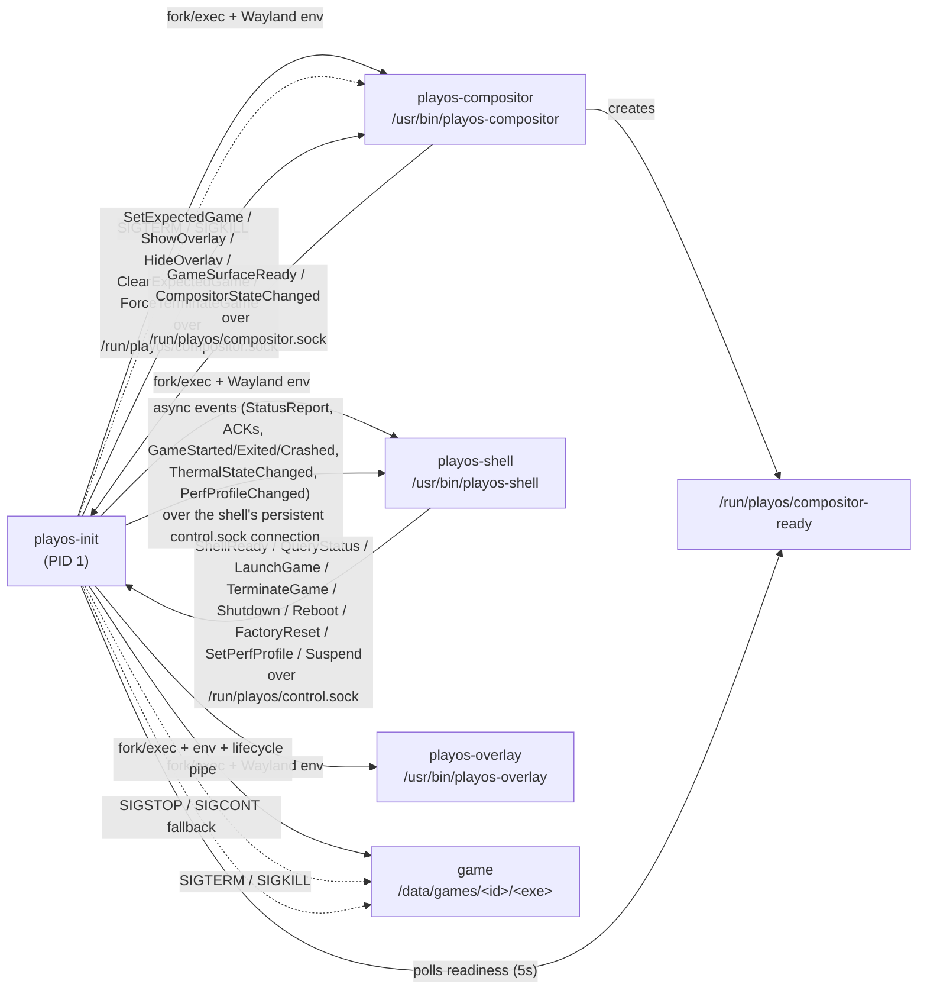
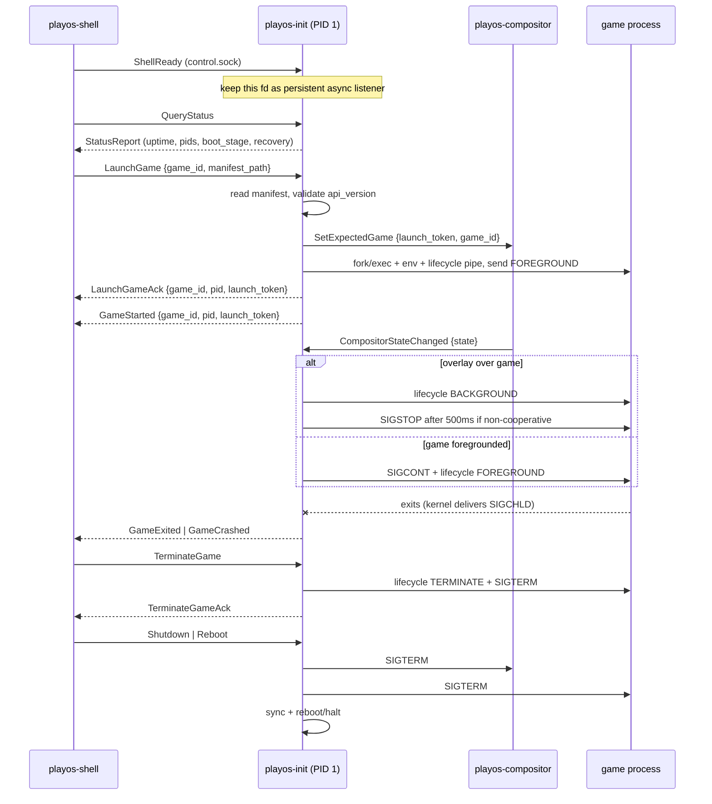

# PlayOS Init

`playos-init` is the PID 1 supervisor for PlayOS. It is not intended to be a general-purpose init system; its job is to boot the system, keep core PlayOS services alive, and orchestrate the startup and lifecycle of the shell, compositor, and games.

## What it does

- Initializes as PID 1 in the initramfs / early boot environment
- Mounts virtual filesystems such as `/proc` and `/sys`
- Discovers and mounts the data partition
- Creates required runtime directories
- Starts the PlayOS IPC server on `/run/playos/control.sock`
- Spawns and supervises the compositor
- Starts `playos-shell` once the compositor is ready
- Launches games and other child processes requested by the shell over IPC
- Reaps child processes and handles recovery / shutdown flows

## Direct Process Interactions

`playos-init` owns a single global `struct playos_init_state` and coordinates every child through a single supervision loop. Each child is `fork()`ed, then in the child: `setsid()`, environment is set, stdout/stderr are redirected to a per-process log on `/data/log`, then `execl()`. The parent tracks the PID and reaps exits via `SIGCHLD` + `waitpid(-1, WNOHANG)`.

### Supervised processes

| Process | Spawn path | stderr log | Restart policy |
|---|---|---|---|
| Compositor (`/usr/bin/playos-compositor`) | `playos_supervisor_spawn_compositor` | `compositor-stderr.log` | 3×/60s → recovery mode |
| Shell (`/usr/bin/playos-shell`) | `playos_supervisor_spawn_shell` | `shell-stderr.log` | 5×/30s → kept running without shell |
| Game (`/data/games/<id>/<executable>`) | `playos_supervisor_spawn_game` | `game-<id>-stderr.log` | none (single game at a time) |
| IPC self-test (`ipc-test-client`) | `main()` first loop | console | none |

Environment passed to children: the compositor receives `XDG_RUNTIME_DIR=/run/playos`, `WAYLAND_DISPLAY=wayland-0`, and `PLAYOS_BACKEND=drm`; the shell receives the first two.

### Inter-process channels

1. **Control socket — `/run/playos/control.sock`** (`SOCK_SEQPACKET`, mode `0660`, `root:playos-trusted` GID 1000). The shell and any trusted process send framed requests; peers are authenticated via `SO_PEERCRED`. Handled message types: `QueryStatus`, `Shutdown`, `Reboot`, `LaunchGame`, `TerminateGame`, `ShellReady`, `FactoryReset`. Wire format is a `"PLOS"` magic + little-endian length + JSON body.
2. **Lifecycle pipe** — a `pipe()` created per game. The write end stays in init; the read end is inherited by the game through the `PLAYOS_LIFECYCLE_FD` environment variable. Single-byte events: `FOREGROUND`, `BACKGROUND`, `SUSPEND`, `RESUME`, `TERMINATE`.
3. **Compositor readiness** — a polled sentinel file `/run/playos/compositor-ready` (5s timeout, then startup proceeds anyway).

### Signals

- `SIGTERM` (graceful) then `SIGKILL` (force) are sent to games and the compositor on termination/shutdown.
- Recovery kills the remaining process group with `kill(-1, SIGTERM/SIGKILL)` before halting.

## Repository layout

- `src/` — init, mount, logging, supervisor, recovery, shutdown, and IPC handling logic
- `include/playos-init/` — public headers
- `ipc/` — bundled IPC framing/server/client code
- `tests/` — compositor/game stubs, IPC test client, and host tests
- `CMakeLists.txt` — build configuration

## Build

### Host build

```bash
cmake -B build
cmake --build build
```

### Cross-compilation

Use the Buildroot toolchain file when building for the target environment:

```bash
cmake -B build -DCMAKE_TOOLCHAIN_FILE=$BR2_EXTERNAL/toolchain.cmake
cmake --build build
```

## Tests

If enabled, host tests can be built and run through CMake:

```bash
cmake -B build -DBUILD_TESTS=ON
cmake --build build
ctest --test-dir build
```

## Runtime notes

- The binary is built statically for initramfs use.
- PID 1 must not exit normally.
- Logging is initialized after the runtime filesystem is available.
- If the data partition is missing, the system enters recovery/provisioning flow.

## Related components

This repository includes small test helpers used for validation and integration testing:

- `playos-compositor-placeholder`
- `playos-game-stub`
- `ipc-test-client`

## Architecture diagrams

### Process and channel map



### Runtime message flow



### Channel summary

- **`/run/playos/control.sock`** — trusted request/response socket (`SOCK_SEQPACKET`, mode `0660`, `root:playos-trusted`, auth via `SO_PEERCRED`). Shell and other trusted clients send framed `PLOS`-magic JSON messages; init replies or pushes async events.
- **`/run/playos/compositor.sock`** — single compositor control connection. Init sends game/overlay coordination messages; compositor reports surface state back.
- **Lifecycle pipe** — one `pipe()` per game. Init keeps the write end; the game inherits the read end via `PLAYOS_LIFECYCLE_FD`. Single-byte events: `FOREGROUND`, `BACKGROUND`, `SUSPEND`, `RESUME`, `TERMINATE`.
- **Signals + readiness file** — init supervises children via `SIGCHLD`/`waitpid`, escalates with `SIGTERM`/`SIGKILL`, and uses `SIGSTOP`/`SIGCONT` as the non-cooperative background fallback. Compositor readiness is the polled `/run/playos/compositor-ready` file.

## License

Add licensing information here if/when it becomes available.
